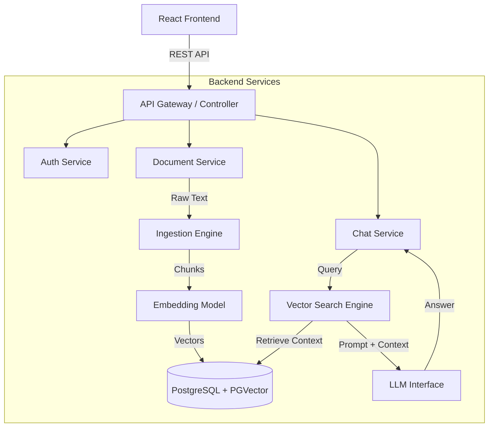

# ScholarFlow: RAG-Powered Research Assistant

**System Design & Proposal Document**

---

## 1. Executive Summary

This document presents the technical proposal for **ScholarFlow**, an intelligent "Second Brain" for students and researchers. Unlike traditional note-taking apps that act as static storage, ScholarFlow utilizes **Retrieval-Augmented Generation (RAG)** to transform static PDF documents into an interactive knowledge base.

The system allows users to upload lecture notes and research papers, which are then processed, embedded, and stored in a vector database. Users can query their knowledge base in natural language (e.g., _"Explain the difference between TCP and UDP based on my notes"_), receiving context-aware answers with citations. This project demonstrates advanced Full Stack engineering by integrating **Spring AI**, **Vector Search**, and **LLM orchestration** into a cohesive learning platform.

---

## 2. Technology Stack

- **Frontend:** React.js, Tailwind CSS, Framer Motion (for chat animations), Axios
- **Backend:** Spring Boot 3.2, Spring AI
- **Database:** PostgreSQL (User Data), PGVector (Vector Embeddings)
- **AI Engine:** OpenAI API (LLM), Jina/OpenAI (Embeddings)
- **Storage:** Local File System / AWS S3 (Document Storage)
- **Tools:** Docker (Containerization), Maven (Build Tool)

---

## 3. High-Level Design (HLD)

The system follows a **Modular Service-Oriented Architecture**. While it can be deployed as a monolith for simplicity, the logical separation ensures that the heavy lifting of AI processing does not block the user interface.

### 3.1 Data Flow Architecture

The data flow is divided into two distinct pipelines: **Ingestion** (Write) and **Retrieval** (Read).

1.  **Ingestion Pipeline (Async):**
    - `User Upload` -> `PDF Parsing` -> `Text Chunking` -> `Embedding Model` -> `Vector Storage (PGVector)`
2.  **Retrieval Pipeline (Sync):**
    - `User Query` -> `Query Embedding` -> `Similarity Search (Cosine)` -> `Context Construction` -> `LLM Inference` -> `Response`

### 3.2 Architecture Diagram Overview

